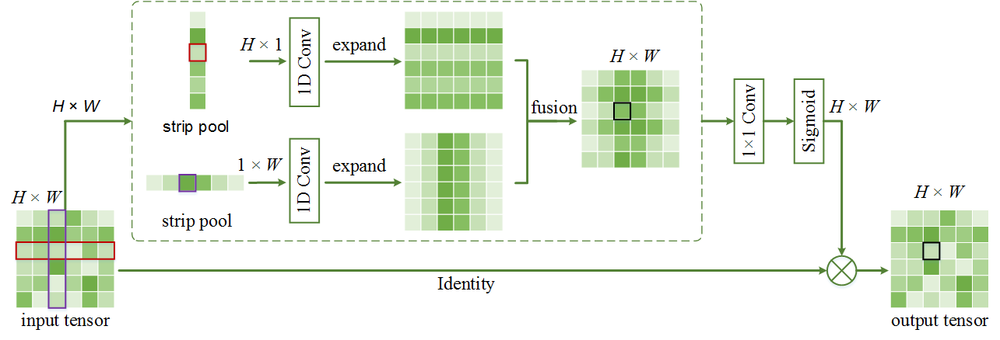

# Strip Pooling: Rethinking Spatial Pooling for Scene Parsing

This repository is a PyTorch implementation for [CVPR2020 paper](https://arxiv.org/pdf/2003.13328.pdf).

The results reported in our paper are originally based on [PyTorch-Encoding](https://github.com/zhanghang1989/PyTorch-Encoding) but the environment settings are a little bit complicated. To ease use, we reimplement our work based on [semseg](https://github.com/hszhao/semseg).

### Strip Pooling




### Usage

Before training your own models, we recommend you to refer to the instructions described [here](https://github.com/hszhao/semseg). Then, you need to update the dataset paths in the configuration files.

Four GPUs with at least 11G memory on each are required for synchronized training. [PyTorch](https://pytorch.org/get-started/locally/) (>=1.0.1) and [Apex](https://github.com/NVIDIA/apex) are required for Sync-BN support. For apex, just follow the "Quick Start" part to install it.

For pretrained models, you can download them from here ([resnet50](https://hangzh.s3.amazonaws.com/encoding/models/resnet50-25c4b509.zip) and [resnet101](https://hangzh.s3.amazonaws.com/encoding/models/resnet101-2a57e44d.zip)) or my [google drive](https://drive.google.com/open?id=1jrm93o5ULjuOHaRQVakVF-e8MC8IAn1X). Then, create a new folder "pretrained" and put the pretrained models in it, like
```
mkdir pretrained
mv downloaded_pretrained_model ./pretrained/
```

For training, just run
```
sh tool/train.py dataset_name model_name
```
For instance, in our case, you can run
```
sh tool/train.py ade20k spnet50
```

For test,
```
sh tool/test.py dataset_name model_name
```
At present, multi-GPU test is not supported. Will implement it later.
